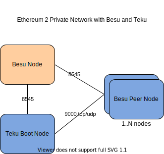

# Teku Private Network

This repository contains code to provision a Teku(Ethereum 2 client) private network in AWS environment. 
Private network consist of one node Besu client, single Teku boot node and
any number of Teku peer-nodes.

Besu node is created with Gensis file. Genesis file includes few accounts with large amount of ether and a contract to
to deposit 32 ethers for validator registration.

Besu client starts first to form the ethereum 1 network. Secondly Teku boot node starts connecting to the ethereum 1 network.
Each Teku node generates validator keys (64) and register keys by depositing 32 ethers via executing the contract. 
Next Teku peer nodes (N number of nodes) are started and join the network by communicating with the Teku boot node.   



#  Creating Network

AWS cloudformation template currently creates resources in a new VPC. 

Pre-requisite
- Access to AWS with sufficient privilege to create vpc, subnet, nacl, security-groups, ec2, autoscaling group
- API access and aws cli configured
- Name of the ssh key for EC2 instances

```bash
aws cloudformation create-stack \
  --stack-name <name for cloud formation stack> \
  --template-body file://cfn-teku-network.yaml \
  --parameters ParameterKey=Owner,ParameterValue=<owner name> \
               ParameterKey=KeyName,ParameterValue=<ssh key name>
``` 

## Cloudformation Template Parameters

Following cloudformation parameters supported.

| Parameter Key    | Default Value    | Description  |
| -------------------- |:-------------| :-----|
| BesuImageTag         | latest       | Besu docker image tag |
| BesuInstanceType     | t3.micro     | Besu can run with t3/t2 micro instance |
| Environment          | dev          | Currently only dev available |
| GitRepository        | https://github.com/ConsenSys/teku-network|   Git repository |
| GitBranch            | master       | Git branch |
| Network              | private      | Currently only private available |
| KeyName              |              | Must provide ssh key name for EC2 instances |
| Owner                |              | Must provide to set the resource owner tag |
| TekuInstanceSpotPrice| 0.05         | Teku peer nodes run with spot instances |
| TekuInstanceType     | t3.medium    | Require at least t3/t2 medium instance |
| TekuPeerNodesCount   | 1            | Number of Teku peer nodes |
| TekuPeerNodesCountMax| 5            | Max Teku peer nodes. Must increase if TekuPeerNodesCount is increased |
| TekuImageTag         | latest       | Teku docker image tag |


# View Logs

Currently no log exports or metric exports configured for these networks. Need to ssh into the EC2 instances to view the logs. Besu and Teku containers are started 
with [run-besu.sh](run-besu.sh) and [run-teku.sh](run-teku.sh) helper scripts. Logs for these scripts are available on the instance at
/tmp folder teku-setup.log and besu-setup.log. Docker containers are started as the last step in these setup scripts and container logs
can be viewed using commands `docker logs -f besu` and `docker logs -f teku`. 
